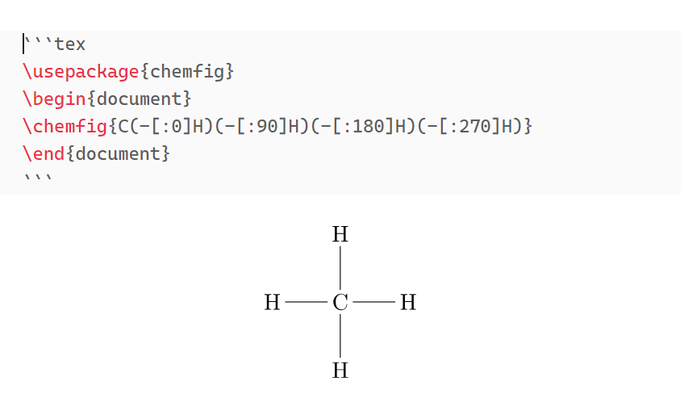

An [Obsidian.md](https://obsidian.md/) plugin to compile TeX to SVG (using MikTeX (pdflatex) & dvisvgm)

I started making this plugin (hopefully I'll manage to make it usful for others) because I wanted to use some package that are not included in the [obsidian-tikzjax](https://github.com/artisticat1/obsidian-tikzjax) plugin.

> [!WARNING]
> - This is an **early** version of the plugin; it may not work as expected. 
> - The plugin is tested on Windows and will probably not work on other platforms.
> - You may need additional customization to make it work on your machine.
> - Desktop only.

# Prerequisites

- [MikTeX](https://miktex.org/download) (for compiling TeX to PDF using `pdflatex`)
- [dvisvgm](https://dvisvgm.de/Downloads/) (for converting PDF to SVG using `dvisvgm`)
- Relevant packages have to be installed in MikTeX

# Installation

Currently, the plugin is not available in the Obsidian community plugins. 

You can clone the repository and build the plugin yourself, using `npm run build` and copying `main.js`, `styles.css`, and `manifest.json` to `YOUR_VAULT/.obsidian/plugins/obsidian-tex-plugin/`.

# Usage

- Use a code block with the `tex` language identifier
- _Don't_ add `\documentclass` (it's added automatically, with the `standalone` class)
- Add packages using `\usepackage`
- Add `\begin{document}` and `\end{document}`

# Example



```tex
\usepackage{chemfig}
\begin{document}
\chemfig{C(-[:0]H)(-[:90]H)(-[:180]H)(-[:270]H)}
\end{document}
```

# TODO 

- [x] add indicator for processing
- [ ] better dark mode support (currently it's just uses css `filter: invert(1)`)
- [x] show errors
- [ ] fix bugs   
- [ ] and more...
