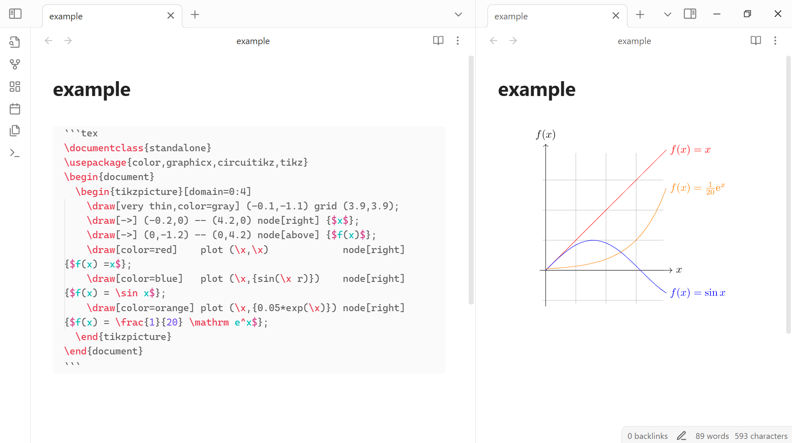

# TeX Plugin for Obsidian

An [Obsidian.md](https://obsidian.md/) plugin to compile TeX to SVG (using MikTeX (pdflatex) & dvisvgm)

I started making this plugin (hopefully I'll manage to finish it) because I wanted some packages that are not included in the [obsidian-tikzjax](https://github.com/artisticat1/obsidian-tikzjax) plugin.

> [!WARNING]
> - This is an **early** version of the plugin; it may not work as expected. 
> - The plugin is tested on Windows and will probably not work on other platforms.
> - You may need additional customization to make it work on your machine.
> - Desktop only.

# Prerequisites

- [MikTeX](https://miktex.org/download) (for compiling TeX to PDF using `pdflatex`)
- [dvisvgm](https://dvisvgm.de/Downloads/) (for converting PDF to SVG using `dvisvgm`)
- Relevant packages for the TeX code you want to compile

# Installation

Currently, the plugin is not available in the Obsidian community plugins. You can clone the repository and build the plugin yourself.

# Usage

- Use a code block with the `tex` language identifier
- Include `\documentclass` at the beginning of your TeX code

# TODO 

- [ ] Add indicator for processing
- [ ] Improve dark mode support
- [ ] Many other enhancements
